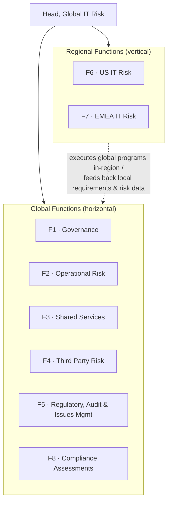

# Org Chart — Layers 1–2

Source of truth for the organization chart. See
[docs/org-structure.md](../docs/org-structure.md) for the narrative, the
matrix rationale, and the subteam cross-link hypotheses. A polished,
shareable version of this same chart lives at the artifact link tracked in
[README.md](../README.md).

## Layer 2 — Subteams

Each function's subgraph below groups its subteams; there's no flow
implied, just ownership. See the Layer 2 tables in
[docs/org-structure.md](../docs/org-structure.md) for descriptions and
subteam codes.

```mermaid
flowchart TB
    subgraph F1["F1 · Governance"]
        direction TB
        F1_1["F1.1 Policy and Procedure Management"]
        F1_2["F1.2 Domain Governance"]
        F1_3["F1.3 Service Management"]
    end

    subgraph F2["F2 · Operational Risk"]
        direction TB
        F2_1["F2.1 Operational Risk Reporting"]
        F2_2["F2.2 Operational Risk Events"]
        F2_3["F2.3 Environmental Scanning"]
        F2_4["F2.4 Risk and Control Self-Assessments"]
    end

    subgraph F3["F3 · Shared Services"]
        direction TB
        F3_1["F3.1 Control Testing"]
        F3_2["F3.2 Reporting"]
        F3_3["F3.3 Data & Automation"]
        F3_4["F3.4 Metrics Management"]
        F3_5["F3.5 Risk and Control Advisory"]
    end

    subgraph F4["F4 · Third Party Risk"]
        direction TB
        F4_1["F4.1 Supplier Control Assessments"]
        F4_2["F4.2 Continuous Monitoring"]
        F4_3["F4.3 Advisory Services"]
        F4_4["F4.4 Shared Services Responsibility Assessment"]
    end

    subgraph F5["F5 · Regulatory, Audit &amp; Issues Mgmt"]
        direction TB
        F5_1["F5.1 Request Intake"]
        F5_2["F5.2 Audit &amp; Reg Prep"]
        F5_3["F5.3 Reg Response"]
        F5_4["F5.4 Client Due Diligence"]
    end

    subgraph F8["F8 · Compliance Assessments"]
        direction TB
        F8_1["F8.1 Payments Assessments"]
        F8_2["F8.2 Cloud Scorecard"]
        F8_3["F8.3 Application Control Assessments"]
        F8_4["F8.4 Infrastructure Control Assessments"]
    end

    subgraph F6["F6 · US IT Risk"]
        direction TB
        F6_1["F6.1 Local Assessments"]
        F6_2["F6.2 Regional Governance"]
        F6_3["F6.3 Regional Issues Management"]
    end

    subgraph F7["F7 · EMEA IT Risk"]
        direction TB
        F7_1["F7.1 Local Assessments"]
        F7_2["F7.2 Regional Governance"]
        F7_3["F7.3 Regional Issues Management"]
    end

    F4_4 -. likely consumes .-> F3
    F6_2 -. applies in-region .-> F1
    F7_2 -. applies in-region .-> F1
    F6_3 -. feeds/consumes .-> F5
    F7_3 -. feeds/consumes .-> F5
    F6_1 -. executes in-region .-> F8
    F7_1 -. executes in-region .-> F8
```

The dotted edges are the cross-links visible from subteam names alone
(see org-structure.md) — hypotheses to confirm, not verified dependencies.

## Matrix interdependency (draft)

Each regional function coordinates with some or all of the global
functions. Hypothesis cells come from the subteam cross-links above; the
rest are genuinely open until services are documented.

| Global Function | US IT Risk | EMEA IT Risk |
|---|---|---|
| Governance | *hypothesis:* F6.2 Regional Governance | *hypothesis:* F7.2 Regional Governance |
| Operational Risk | _tbd — no named regional counterpart_ | _tbd — no named regional counterpart_ |
| Shared Services | _tbd — no named regional counterpart_ | _tbd — no named regional counterpart_ |
| Third Party Risk | _tbd_ | _tbd_ |
| Regulatory, Audit & Issues Management | *hypothesis:* F6.3 Regional Issues Management | *hypothesis:* F7.3 Regional Issues Management |
| Compliance Assessments | *hypothesis:* F6.1 Local Assessments | *hypothesis:* F7.1 Local Assessments |
