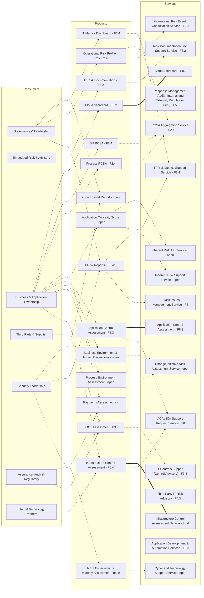

# Reference Architecture Diagram — Consumers × Products × Services

Source of truth for the three-layer interconnection diagram. See
[docs/reference-architecture.md](../docs/reference-architecture.md) for
the full taxonomy and the confidence levels behind each edge below. An
interactive version — with hover-to-trace links and candidate-owner (F.*)
tags on every product and service — lives in the Process tab of the
operating-model artifact linked from [README.md](../README.md).

Solid edges are confirmed by name match; dotted edges are hypotheses.
Same visual convention as [diagrams/org-chart.md](org-chart.md). Consumer
nodes use the group-level names from
[docs/reference-architecture.md](../docs/reference-architecture.md#consumers)
— all 21 individual consumers would make this unreadable.

40 edges total: 3 confirmed (product↔service, by name match), 37
hypotheses (16 product↔service, 21 consumer↔product). Every Product and
Service node carries its candidate owner (the `F.*` reference key from
[docs/org-structure.md](../docs/org-structure.md)) — `open` means
ownership isn't confirmed. Unmapped-to-a-product-or-service nodes:
**Crown Jewel Report** and **Payments Assessments** on the product side;
**Response Management (Audit - Internal and External, Regulatory, Client)**,
**Third Party IT Risk Advisory**, and **Application Development &
Automation Services** on the service side. See the open questions in
[docs/reference-architecture.md](../docs/reference-architecture.md).
